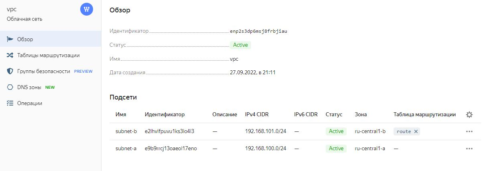
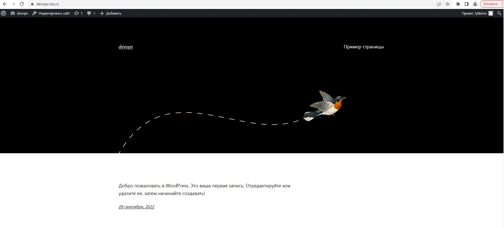
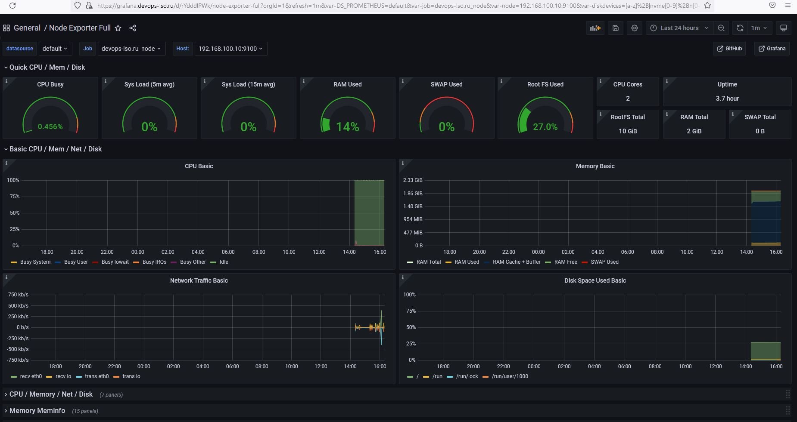

# Diplom

1. Регистрация доменного имени  

2. Создание инфраструктуры

YC  
  

YC_Bucket  

YC_DNS  
  

YC_VM  
  

YC_VPC  
  

3. Установка Nginx и LetsEncrypt  

  

  

4. Установка кластера MySQL  

DB1_master  

  

DB2_slave  

  

5. Установка WordPress  

  

  

6. Установка Gitlab CE и Gitlab Runner

CI-CD_runner  

  

Gitlab-ci

  

SSH  

  

HelloWorld.php  

  

Tags  

  

Pipelines  

  

Deploy  

  

7. Установка Prometheus, Alert Manager, Node Exporter и Grafana  

Alertmanager_config  

  

Alertmanager_status  

  

Prometheus  

  

Grafana_app  

  

Grafana_db01  

  

Grafana_db02  

  

Grafana_gitlab  

  

Grafana_monitoring  

  

Grafana_proxy  

  

Grafana_runner  

  
